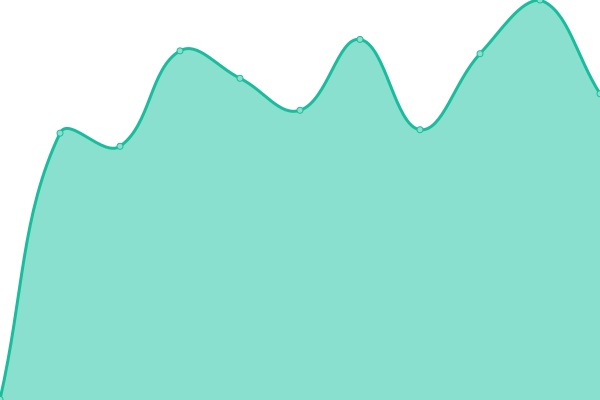

# [📈 Live Status](https://demo.upptime.js.org): <!--live status--> **🟧 Partial outage**

This repository contains the open-source uptime monitor and status page for [Upptime](https://upptime.js.org), powered by [Upptime](https://github.com/upptime/upptime).

With [Upptime](https://upptime.js.org), you can get your own unlimited and free uptime monitor and status page, powered entirely by a GitHub repository. We use [Issues](https://github.com/upptime/upptime/issues) as incident reports, [Actions](https://github.com/urian121/octopus-server-monitoring/actions) as uptime monitors, and [Pages](https://demo.upptime.js.org) for the status page.

<!--start: status pages-->
<!-- This summary is generated by Upptime (https://github.com/upptime/upptime) -->
<!-- Do not edit this manually, your changes will be overwritten -->
<!-- prettier-ignore -->
| URL | Status | History | Response Time | Uptime |
| --- | ------ | ------- | ------------- | ------ |
|  [UrianViera](https://www.urianviera.com) | 🟩 Up | [urian-viera.yml](https://github.com/urian121/octopus-server-monitoring/commits/HEAD/history/urian-viera.yml) | 

 556ms
     
 | 

<a href="https://urian121.github.io/octopus-server-monitoring/history/urian-viera">100.00%</a>
    

|  [GitLab Octapus](https://gitlab.octapus.io) | 🟩 Up | [git-lab-octapus.yml](https://github.com/urian121/octopus-server-monitoring/commits/HEAD/history/git-lab-octapus.yml) | 

 584ms
     
 | 

<a href="https://urian121.github.io/octopus-server-monitoring/history/git-lab-octapus">100.00%</a>
    

|  [Tenant Chevyplan](https://chevyplan.akila-prod.octapus.io/admin/login/) | 🟩 Up | [tenant-chevyplan.yml](https://github.com/urian121/octopus-server-monitoring/commits/HEAD/history/tenant-chevyplan.yml) | 

 293ms
     
 | 

<a href="https://urian121.github.io/octopus-server-monitoring/history/tenant-chevyplan">100.00%</a>
    

|  [Instancia N8N](https://auto.octapus.io/home) | 🟩 Up | [instancia-n8-n.yml](https://github.com/urian121/octopus-server-monitoring/commits/HEAD/history/instancia-n8-n.yml) | 

 300ms
     
 | 

<a href="https://urian121.github.io/octopus-server-monitoring/history/instancia-n8-n">94.45%</a>
    

|  [Prueba IPv6 (TCP Ping)](forwardemail.net) | 🟥 Down | [prueba-i-pv6-tcp-ping.yml](https://github.com/urian121/octopus-server-monitoring/commits/HEAD/history/prueba-i-pv6-tcp-ping.yml) | 

 0ms
     
 | 

<a href="https://urian121.github.io/octopus-server-monitoring/history/prueba-i-pv6-tcp-ping">0.00%</a>
    

<!--end: status pages-->

[**Visit our status website →**](https://demo.upptime.js.org)

## 📄 License

- Powered by: [Upptime](https://github.com/upptime/upptime)
- Code: [MIT](./LICENSE) © [Anand Chowdhary](https://anandchowdhary.com), supported by [Pabio](https://pabio.com)
- Data in the `./history` directory: [Open Database License](https://opendatacommons.org/licenses/odbl/1-0/)
